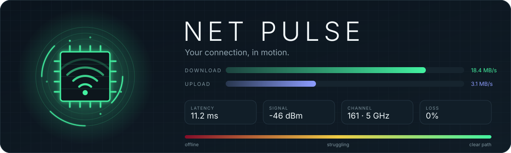
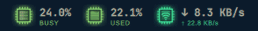
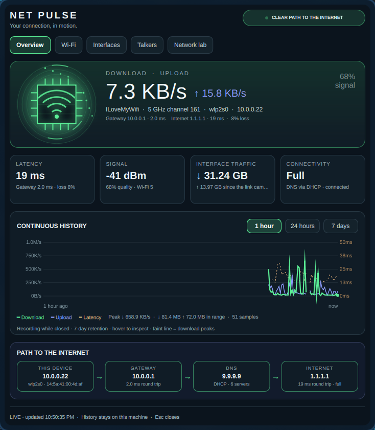
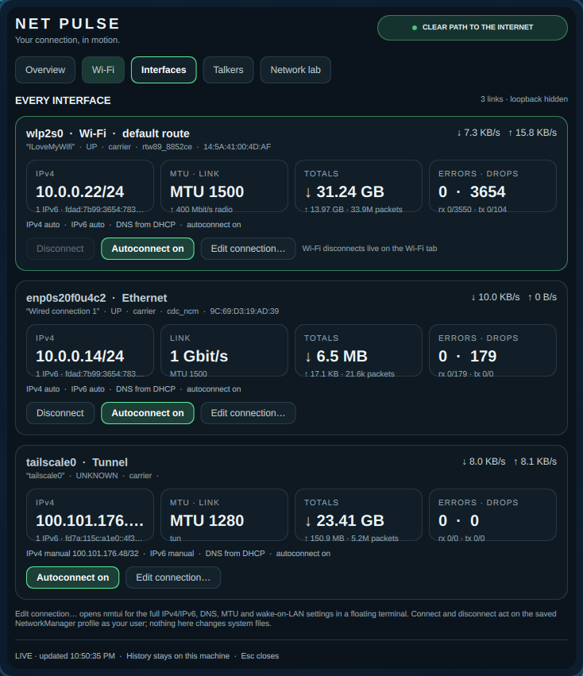
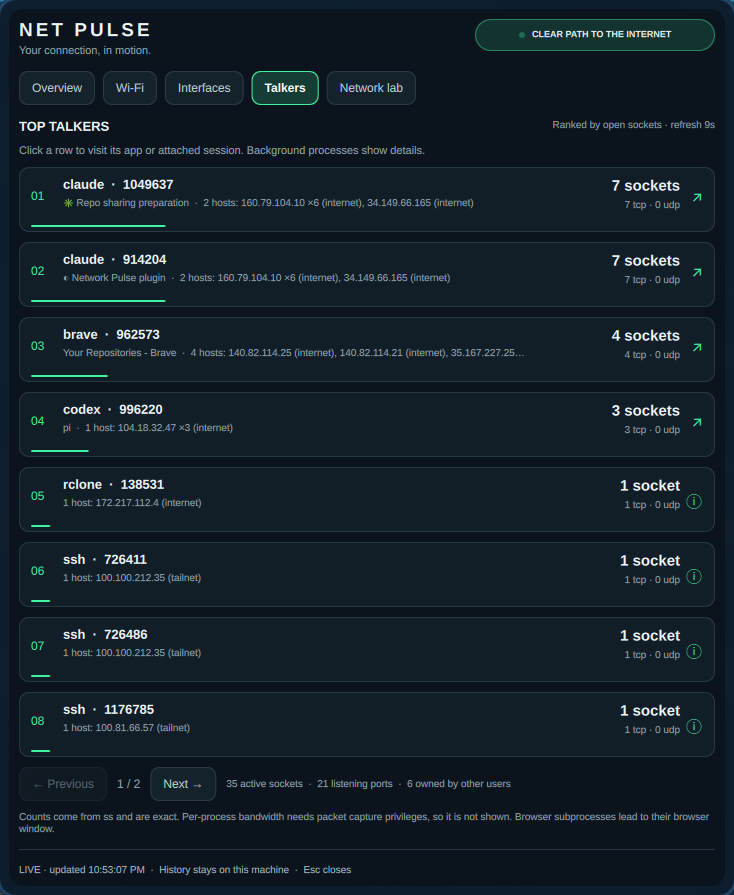
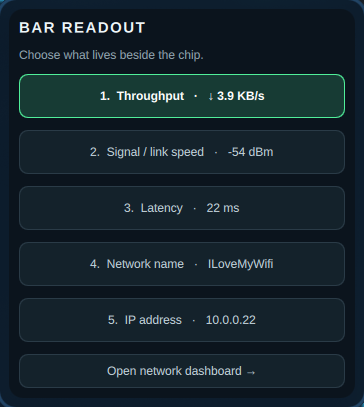

<p align="center">
  
</p>

<p align="center">
  <a href="#install"></a>
  <a href="LICENSE"></a>
  <a href="https://github.com/nixfred/omacpu"></a>
  <a href="https://github.com/nixfred/ram.plugin.omarchy"></a>
  
</p>

# Net Pulse

An animated, glowing network chip for the Omarchy top bar. Green on a clear path to the internet → yellow when latency, loss or a weak radio bite → dark red when nothing is carrying traffic. The chip wears a radio when you are on Wi-Fi and a wired jack when you are on Ethernet, and packets run its pins faster as throughput rises.

<p align="center">
  
  <br>
  <sub>CPU Pulse, RAM Pulse and Net Pulse on one bar. Same chip, same colour language.</sub>
</p>

Left-click opens the dashboard. Right-click offers five saved readouts: throughput, signal or link speed, latency, network name, IP address.

Net Pulse is the sibling of [CPU Pulse](https://github.com/nixfred/omacpu) and [RAM Pulse](https://github.com/nixfred/ram.plugin.omarchy): same chip, same colours, same dashboard layout, so the three sit together on the bar. It replaces the stock `omarchy.network` widget in place and keeps its bar slot.

## The dashboard

<table>
  <tr>
    <td width="50%" valign="top"></td>
    <td width="50%" valign="top"></td>
  </tr>
  <tr>
    <td valign="top"><b>Overview.</b> Hero chip, live download and upload, latency to the gateway and to the internet with packet loss, link or signal, your address, connectivity state, 1-hour / 24-hour / 7-day history, and a hop-by-hop path from this device through the gateway and DNS to the internet.</td>
    <td valign="top"><b>Interfaces.</b> A card for every link — Ethernet, Wi-Fi, tunnels, bridges — with its addresses, live rates, lifetime totals, errors and drops, and the saved NetworkManager profile: IPv4 and IPv6 method, DNS, autoconnect, metered flag, wake-on-LAN. Connect, disconnect, flip autoconnect, or open the full editor.</td>
  </tr>
  <tr>
    <td width="50%" valign="top"></td>
    <td width="50%" valign="top"></td>
  </tr>
  <tr>
    <td valign="top"><b>Talkers.</b> The 24 processes holding the most open connections, eight per page, with a TCP/UDP split and the remote hosts each one is talking to, labelled LAN, tailnet or internet. Click a row to focus its existing window or attached Herdr / tmux pane.</td>
    <td valign="top"><b>Readout picker.</b> Right-click the chip to choose what lives beside it. Keys 1–5 pick a mode; the choice is saved to your bar layout.</td>
  </tr>
</table>

The **Wi-Fi** tab carries the live association — dBm and quality, channel, width and band, negotiated rates each way, Wi-Fi generation, transmit power, retries, failures and beacon loss, and how long the association has held — above every nearby network, grouped by name with its access-point count, ready to connect, forget or take a passphrase. Band pinning and the radio switch live there too.

The **Network lab** tab holds every resolver systemd-resolved is using per link, with one-click DHCP / Cloudflare / Google switching and a cache flush; a 10-ping latency burst with jitter, a public-address lookup, a connectivity re-check and the speed test; then the transport counters — established connections, retransmits, new connections per second, socket pools, listening ports, resets — and the routing table.

## What it does

- Animated chip that knows what it is plugged into: signal arcs on Wi-Fi, a wired jack with a running link light on Ethernet, a broken ring when there is no route. Packet speed follows real throughput.
- Continuous 1-hour, 24-hour and 7-day history of download, upload, latency and signal, with the per-bucket download peak as a faint envelope and hover readings. Missing history is left blank; shutdowns and recording gaps break the trace.
- Wi-Fi that reads like a radio should: dBm and quality, channel and width, the band, negotiated rates each way, Wi-Fi 4/5/6/7, transmit power, retries, failures and beacon loss, and how long this association has held.
- Connect, disconnect and forget networks; WPA and WPA3 passphrases and 802.1X enterprise logins; pin the 2.4, 5 or 6 GHz band or hand it back to automatic; turn the radio off; share the current network as a QR code.
- Every interface with its own card, including tunnels like Tailscale and WireGuard, and the saved NetworkManager profile behind it.
- Processes ranked by open sockets with their remote endpoints classified as LAN, tailnet or internet.
- Click any address — yours, the gateway, the resolver, a route's next hop, an interface's IPv4 or IPv6 — to copy it to the clipboard.
- DNS provider switching through `omarchy-dns` and a resolver cache flush, both the same paths the stock widget uses.

There are no process termination, firewall, route, sysctl or privileged tuning actions. Processes and window identities are revalidated on every focus click. Session routing uses argument arrays and validated IDs, never interpolated shell commands. DNS provider and band names are checked against fixed lists and connection IDs against a UUID pattern. Passphrases travel over D-Bus, or over stdin for enterprise profiles, and never appear in a command line or in this plugin's state.

## Install

Requires an existing Omarchy Quickshell desktop, Python 3, systemd user services, Hyprland and NetworkManager. No additional Python packages. `iw` is used for radio detail; without it the Wi-Fi tab still works from NetworkManager data.

```sh
git clone https://github.com/nixfred/omanet.plugin.omarchy.git
cd omanet.plugin.omarchy
python3 install.py
```

Installs under `~/.config/omarchy/plugins/nixfred.net-pulse`, takes the stock `omarchy.network` widget's slot in the bar (appending to the far right if that widget is not present), and enables `net-pulse.service` for the graphical session. Existing files and the bar layout are backed up under `~/.local/state/omarchy/backups/net-pulse-TIMESTAMP/`.

The recorder runs independently of the shell and popup: throughput and pings every 2 seconds, NetworkManager and Wi-Fi state every 6, sockets every 9, DNS and routes every 15, history every 15. SQLite retains seven days (up to 40,320 samples), downsampled to ~240 points per displayed range; per-bucket peaks are retained. State is private (`0700` directory / `0600` files) in `$XDG_STATE_HOME/net-pulse` or `~/.local/state/net-pulse`. History stores aggregate metrics only — no addresses, host names or process identities. The latest snapshot contains process names, PIDs, window titles and remote addresses, and is replaced, not logged. Closed panels stop their large animations, and Wi-Fi scanning runs only while the Wi-Fi tab is open.

## Controls and diagnosis

```sh
omarchy-shell nixfred.net-pulse open
omarchy-shell nixfred.net-pulse modes
omarchy-shell nixfred.net-pulse status
omarchy-shell nixfred.net-pulse rescan
systemctl --user status net-pulse.service
journalctl --user -u net-pulse.service
python3 net_pulse.py snapshot          # one-shot JSON, no daemon needed
python3 -m unittest discover -s tests -v
node tests/test_model.cjs
omarchy plugin validate .
```

Left/right arrows change dashboard tabs. Escape closes. Keys 1–5 select modes in the right-click picker. Inline bar setting `animated: false` disables chip animations.

Disable with `omarchy plugin disable nixfred.net-pulse` and `systemctl --user disable --now net-pulse.service`. This stops only this plugin's telemetry service; historical data stays available. Restore the timestamped `shell.json` backup to bring the stock network widget back to its slot.

## Accounting

Throughput is the delta of `/proc/net/dev` byte counters over the sampling interval, so it counts framed bytes on the interface, not payload. Units are decimal: 1 MB/s is 1,000,000 bytes per second, matching how link rates and speed tests are quoted. A counter reset or a newly appeared interface reads zero rather than a spike.

Latency is a single `ping` per probe cycle to the default gateway and to 1.1.1.1, averaged over the last 24 samples. A timed-out probe is kept as a loss, not dropped, so the loss percentage is real; `null` means no sample has come back yet, which is different from a timeout. The gateway probe measures your local link, the internet probe measures the whole path.

Wi-Fi signal in dBm comes from `iw`; the 0–100 quality is NetworkManager's own figure for the associated access point. Negotiated rates are the current PHY rates, which is the ceiling of what the radio could carry, not what you are using. Nearby networks are grouped by name: one row can stand for several access points, and its channel, band and rate come from the strongest one.

Socket counts come from `ss` and are exact. Per-process bandwidth is deliberately absent: attributing bytes to a process needs packet capture privileges this plugin does not take. RSS-style double counting does not apply here, but a process holding many sockets to one host is not necessarily using more bandwidth than one holding a single busy socket.

References: [/proc/net/dev](https://docs.kernel.org/networking/statistics.html), [NetworkManager](https://networkmanager.dev/docs/api/latest/), [systemd-resolved](https://www.freedesktop.org/software/systemd/man/latest/resolvectl.html), [iw](https://wireless.wiki.kernel.org/en/users/documentation/iw), [Quickshell.Networking](https://quickshell.org/docs/master/types/Quickshell.Networking/).

## Layout

| File | Role |
|---|---|
| `Panel.qml` | Bar widget, five-tab dashboard, readout picker, Wi-Fi actions, IPC handler |
| `NetChip.qml` | The animated chip (compact on the bar, large in the hero card) |
| `HistoryGraph.qml` | Throughput and latency history with peak envelope and hover |
| `Model.js` | Colour ramp, health score, formatting, readout modes |
| `net_pulse.py` | Telemetry daemon, SQLite history, focus and network actions |
| `install.py` | Copies the plugin, enables the service, takes the network widget's bar slot with backups |
| `tests/` | Python unit tests, a Node check of the model helpers, and QML widget tests |

## License

MIT. See [LICENSE](LICENSE).
